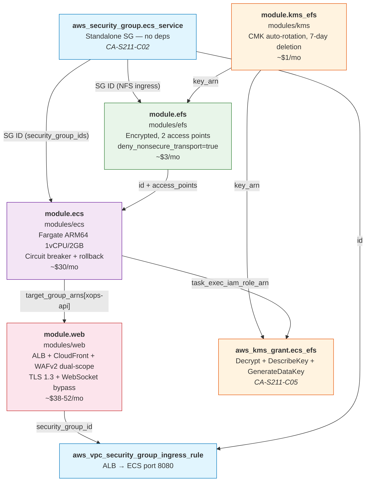
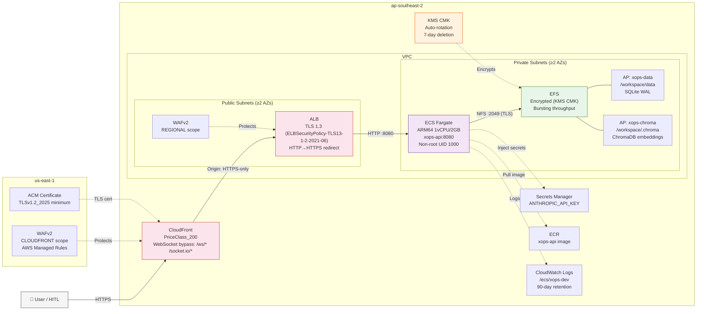
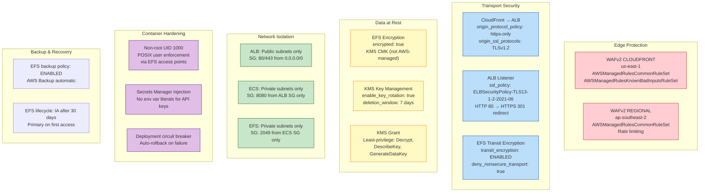

# xOps Account Composition

> **Sprint**: xOps-S2 | **Story**: S2-11 | **Cost Target**: BC1 ≤$100/mo | **Region**: ap-southeast-2

Composes 4 derived modules from `terraform-aws/modules/` into a complete xOps deployment stack.
All modules follow ADR-023 (derived module pattern) with FOCUS 1.2+ tags, APRA CPS 234 defaults, and TLS 1.3 enforcement.

## D1 — Module Dependency Graph

The standalone `aws_security_group.ecs_service` at the top breaks the circular dependency
between EFS (needs ECS SG ID for NFS ingress) and ECS (needs EFS filesystem ID for volume mounts).



**Dependency resolution order** (Terraform resolves automatically):

```
1. aws_security_group.ecs_service  (no dependencies)
2. module.kms_efs                  (no dependencies — parallel with #1)
3. module.efs                      (depends on #1 SG ID + #2 key_arn)
4. module.web                      (no module deps — ALB created independently)
5. module.ecs                      (depends on #3 EFS ID + #4 target_group_arn)
6. aws_kms_grant.ecs_efs           (depends on #2 key_arn + #5 task_exec_role_arn)
7. aws_vpc_security_group_ingress  (depends on #1 SG ID + #4 web SG ID)
```

## D2 — Network Topology



## D3 — Security Controls (APRA CPS 234)



## D4 — Cost Breakdown (BC1 Target: ≤$100/mo)

| Component | Module | Spec | Monthly Cost |
|-----------|--------|------|-------------|
| ECS Fargate | `modules/ecs` | ARM64 Graviton, 1 vCPU, 2 GB, 1 task | $30 |
| ALB | `modules/web` → `modules/alb` | 1 LB, HTTPS listener, health checks | $25 |
| CloudFront | `modules/web` → `modules/cloudfront` | PriceClass_200 (includes AP), WebSocket bypass | $7–15 |
| WAFv2 (dual) | `modules/web` | REGIONAL + CLOUDFRONT scope, 2 managed rule groups | $6–12 |
| EFS | `modules/efs` | Bursting throughput, ~5 GB (SQLite + ChromaDB) | $3 |
| KMS CMK | `modules/kms` | 1 key, auto-rotation enabled | $1 |
| ECR | _(inline)_ | ~2 GB image storage | $2 |
| CloudWatch | _(inline)_ | `/ecs/xops-dev`, 90-day retention | $3–5 |
| Secrets Manager | _(inline)_ | 1 secret (ANTHROPIC_API_KEY) | $1 |
| ACM | _(free)_ | 2 certificates (ap-southeast-2 + us-east-1) | $0 |
| Route53 | `modules/web` | 1 hosted zone + 1 alias record | $0.50 |
| **Total** | | **BC1 ECS deployment** | **$78–94/mo** |

### Cost by Phase

| Phase | What | Monthly Cost |
|-------|------|-------------|
| **BC1 Local** | Docker Compose (Ollama + WebUI + API) | $0 |
| **BC1 ECS** | ECS Fargate + ALB + CF + WAF + EFS (no Ollama) | $78–94 |
| **BC2** | BC1 ECS + Ollama 8B on separate ECS task (2vCPU/8GB) | $150–180 |

### ROI

| Metric | Value |
|--------|-------|
| Current SaaS cost | $2,000/mo |
| BC1 ECS target | ≤$100/mo |
| Savings | $1,900+/mo (95%) |
| ROI multiplier | **21× at BC1** |

## Source Strategy (ADR-026)

| Context | Module Source |
|---------|-------------|
| **Dev** (local iteration) | `source = "../../modules/{name}"` |
| **Prod** (versioned) | `source = "github.com/nnthanh101/terraform-aws//modules/{name}?ref=v2.2.1"` |
| **Registry** (backup) | `source = "app.terraform.io/oceansoft/{name}/aws"` |

## Quick Start

```bash
# 1. Init (portable — bucket injected at init time)
cd accounts/xops
terraform init \
  -backend-config="bucket=${ACCOUNT_ID}-tfstate-ap-southeast-2" \
  -backend-config="region=ap-southeast-2"

# 2. Validate (no credentials needed)
terraform validate
terraform fmt -check

# 3. Plan (requires AWS credentials)
terraform plan -var-file=dev.tfvars -out=tfplan

# 4. Cost estimate
infracost diff --path=. --terraform-var-file=dev.tfvars

# 5. Security scan
checkov -d . --framework terraform

# 6. Apply (HITL gate — requires explicit approval)
terraform apply tfplan
```

## Files

| File | LOC | Purpose |
|------|-----|---------|
| `providers.tf` | 23 | Dual-region AWS + version constraints |
| `backend.tf` | 14 | S3 native locking (ADR-006, no DynamoDB) |
| `variables.tf` | 149 | Input variables with validation |
| `main.tf` | 360 | 4 module compositions + SG + KMS grant |
| `outputs.tf` | 84 | Module output pass-through |
| `dev.tfvars` | 45 | Dev environment values |
| **Total** | **675** | |
